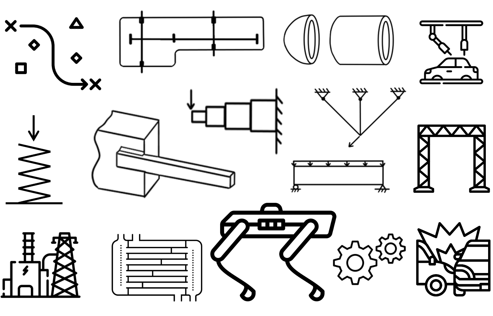
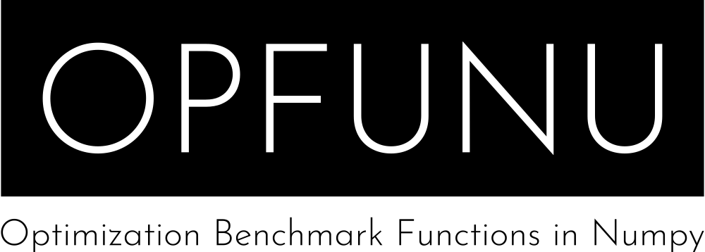
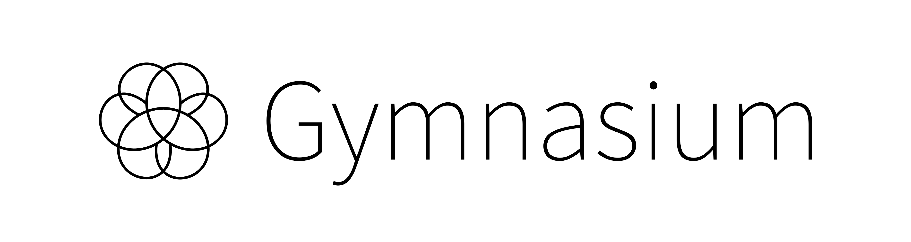
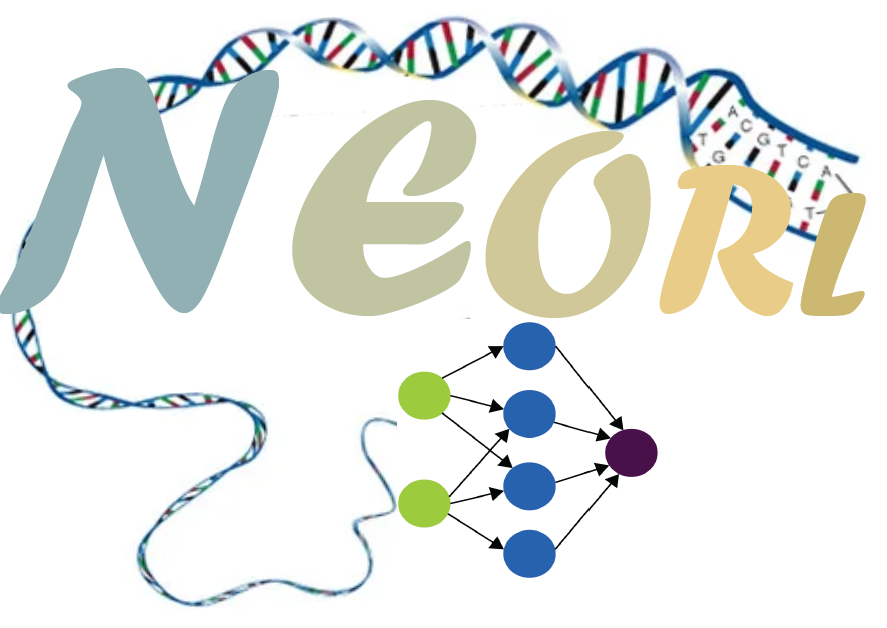
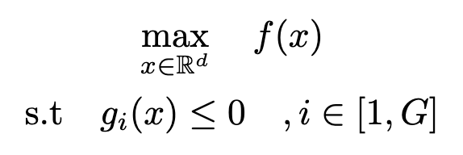

# BOCode: Benchmarks for Optimization and Computational design

> [!IMPORTANT]
>
> The optimization tasks in this library can be used for all kinds of optimization algorithms benchmarking. 
> Key difference: Bayesian optimization algorithms are typically MAXIMIZING

We present BOCode, a Python and PyTorch-based library that contains the most comprehensive suite of engineering design optimization problems and an interface to popular synthetic optimization problems, with access to 300+ problems for optimization algorithm benchmarking. Our goal is to provide not only a Python optimization benchmark library but also to allow the PyTorch interface for facilitating machine learning optimization algorithms and applications such as surrogate and Bayesian optimization.

# What is in BOCode?

## Engineering design problems
We present a diverse collection of engineering design problems including car design, cantilever beam, truss structure optimization, and physics simulation of robotics problems. 

<center></center>


## Interface to popular benchmarks

| [Botorch](https://botorch.org/)  | [BBOB/COCO](https://coco-platform.org/) | [OPFUNU<br/>(IEEE CEC benchmarks)](https://github.com/thieu1995/opfunu) | [Gym Mujoco](https://www.gymlibrary.dev/environments/mujoco/index.html) | [NEORL](https://neorl.readthedocs.io/en/latest/#) |
| :------: | :------:  | :------:   | :------:   | :------:   |
|   |       |         |   |   |

(still editing) Other open-source libraries and benchmarks: [MODAct](https://github.com/epfl-lamd/modact), [Lassobench](https://github.com/ksehic/LassoBench), [BayesianCHT](https://github.com/TsaiYK/BayesianCHT), [DTLZ](https://www.research-collection.ethz.ch/handle/20.500.11850/145762), [WFG](https://ieeexplore.ieee.org/document/1705400), [ZDT](https://pubmed.ncbi.nlm.nih.gov/10843520/)

# Installation

For our own testing now:
```
pip install git+https://github.com/rosenyu304/OptBenckmarkLibrary
```

After PyPI upload:
```
pip install bocode
```

# Optimization Problem Definition
Here we define all our problems for **maximization** optimization algorithms (for minimization, negate the evaluated value). For the constraints here, they are inequality constraints with constraint values (gx) <= 0 as feasible.

<center></center>

# Example Usage

For details of each problem's usage, please read our docs. Here we provide examples to common usage of this library:

1. Direct evaluation
```python
import bocode
import torch

# Instantiate a Synthetic benchmark problem
problem = bocode.Engineering.Car()

# Evaluate at a point
x = torch.Tensor([[0.0] * problem.dim])
constraints, values = problem._evaluate_implementation(x)

print(f"Is it feasible? {(constraints<=0).all()}")
print(f"Function value at origin: {values[0]}")
```

2. Scaling parameters sampled from unit hypercube (typical Bayesian optimization practice)
```python
import bocode
import torch

# Instantiate a Synthetic benchmark problem
problem = bocode.Synthetics.Ackley(show_info=True) # show_info=True to show info of the problem 

# Evaluate at a in bounds of [0,1]s
x = torch.rand(5,problem.dim)
print("X in [0,1]s:\n",x,"\n")

# Scale it w.r.t. the problem bounds
x = problem.scale(x)
print("Scaled X in bounds:\n",x)
constraints, values = problem._evaluate_implementation(x)

print(f"Is each sample feasible? {(constraints<=0).all(dim=1)}")
print(f"Function value at origin: {values[0]}")
```

3. Example using a scipy minimization for this

4. Synthetic function visualization


# Development

BOCode is an open source project and we welcome contributions! If you want to add a new problem, please reach out to us first to see if it is a good fit for BOCode.

# Citing

1. If you use BOCode in your research, please cite the following paper:
```
todo
```

2. If you use the the BOCode interfaces to other libraries or open source code functions (ex: BoTorch, BBOB, NEORL, MODAct, LassoBench, ...), please cite them accordingly.


# License
BOCode is MIT licensed, as found in the LICENSE file.