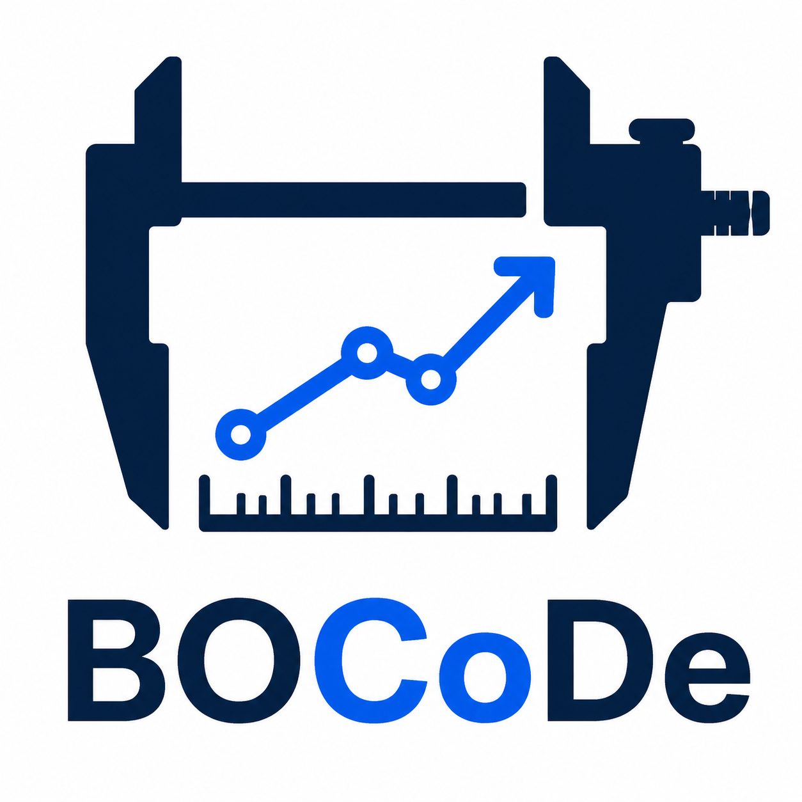

<p align="center">
  
</p>

<h1 align="center">BOCoDe: Benchmarks for Optimization and Computational Design</h1>

[](https://badge.fury.io/py/bocode)

[](
    https://github.com/astral-sh/ruff)

BOCoDe is a Python/PyTorch library of optimization benchmark problems for
benchmarking optimization algorithms, with a first-class BoTorch/Ax interface for
Bayesian optimization research. It collects **307 benchmark problems** — 159
engineering, 80 hyperparameter-optimization (HPO), and 68 synthetic — spanning
five optimization classes (single-/multi-objective, unconstrained/constrained,
and mixed-variable), with an emphasis on real-world engineering, control,
materials-science, and HPO problems drawn from the literature and cited to
their sources.

> [!IMPORTANT]
> Output objective values are meant to be **maximized** (the library was designed
> for Bayesian optimization). For minimization algorithms, negate the objective.
> Constraints are **inequality constraints**: `gx <= 0` is feasible.

> [!NOTE]
> The library is still under construction. Please open a pull request or an issue
> to let us know if you run into problems. Thanks!

# 💡 What is in BOCoDe?

Every problem carries per-problem JSON metadata and a cited source, and is
accessed by name through a central registry. The benchmark set covers **307
problems across three domains**:

| Domain | Examples | Count |
|---|---|---|
| **Engineering** | trusses, pressure vessel, speed reducer, Mazda car design, CEC2020 real-world constrained suite, RE/CRE multi-objective suite, MODAct actuators, MuJoCo control, materials-science datasets (AgNP, CrossedBarrel, P3HT, Perovskite, AutoAM) | 159 |
| **HPO** | Bayesmark, HPO-B, LCBench, LassoBench real datasets (DNA, Leukemia, …) | 80 |
| **Synthetic** | Ackley, Rosenbrock, ZDT, DTLZ, MW, mixed-variable variants | 68 |

By optimization class: SO-Unconstrained (150), SO-Constrained (48),
MO-Unconstrained (26), MO-Constrained (26), SO-Mixed-Variable (57). The
registry also ships additional problems beyond this benchmark set (e.g.
combinatorial TSP and EPFL logic-synthesis tasks).

See **[CATEGORIZATION.md](CATEGORIZATION.md)** for the full per-problem table
(dimensions, objectives, constraints, variable types, convexity, NP-hardness)
and the NP-hardness assessment methodology.

# 💻 Installation

Core install (enough to import `bocode` and run most problems):

```bash
pip install bocode
```

Some problems need heavy or native dependencies, shipped as optional **extras**.
Install only what you need:

```bash
pip install "bocode[mujoco]"     # MuJoCo control problems
pip install "bocode[truss]"      # Truss10D..Truss200D
pip install "bocode[box2d]"      # RobotPush
pip install "bocode[modact]"     # MODAct suite
pip install "bocode[hpo]"        # SVM
pip install "bocode[mazda]"      # Mazda car design
pip install "bocode[neorl]"      # QPowerModel surrogate
pip install "bocode[tabicl]"     # TabICL foundation-model surrogate (tabicl_* methods)
pip install "bocode[tabpfn]"     # TabPFN foundation-model surrogate (tfm_* / pfn_cei methods)
pip install "bocode[hebo]"       # HEBO optimizer (hebo method)
pip install "bocode[all]"        # everything available on PyPI
# bounce (bounce method) is not on PyPI: install from the official source tree with
#   pip install --no-deps --no-build-isolation <bounce repo> && pip install gin-config
# Known-good upstream versions (pinned in requirements-lock.txt):
#   HEBO  : github.com/huawei-noah/HEBO @ ee6112d (v0.3.6, `#subdirectory=HEBO`)
#   bounce: github.com/LeoIV/bounce      @ 738b9bd (v0.1.0) + gin-config
```

| Extra | Enables | Backing dependency |
|---|---|---|
| `mujoco` | MuJoCo locomotion problems | `gymnasium[mujoco]` |
| `control` | CartPole / Acrobot | `gymnasium` |
| `truss` | Truss10D…Truss200D | `slientruss3d` |
| `box2d` | RobotPush | `Box2D`, `pygame`, `joblib` |
| `modact` | MODAct CS/CT/CTS/CTSE/CTSEI | `modact` |
| `hpo` | SVM and the weighted-Lasso (LassoBench) problems | `scikit-learn` |
| `mazda` | Mazda | `openpyxl` |
| `neorl` | QPowerModel | `onnxruntime` |
| `viz` | function visualization | `dash`, `plotly`, `matplotlib` |

The Lasso problems are a clean-room weighted-Lasso reimplementation that needs only
scikit-learn (the `hpo` extra); their datasets are fetched from OpenML on first use
(network required). See `bocode/opt_problems/hpo/_lasso_base.py` for how it differs
from upstream LassoBench.

Accessing a problem without its extra installed raises a clear error telling you
which extra to install.

### Large data files

A few problems use large data (the SVM dataset, the MOPTA08 and Mazda binaries).
These are **not shipped** in the package; they are downloaded on first use to
`~/.cache/bocode` (override with `BOCODE_CACHE_DIR`) and verified by checksum. Set
`BOCODE_DATA_BASE_URL` to point at a mirror if needed.

# 🔍 Example Usage

Problems are accessed by name (flat API) or via the registry:

```python
import bocode
import torch

# List and filter problems by metadata
bocode.list_problems(application="Engineering")
bocode.list_problems(num_objectives=2, constrained=True)

# Instantiate by name (both forms are equivalent)
problem = bocode.Car()
problem = bocode.get_problem("Car")()

# Inspect metadata
meta = bocode.get_metadata("Car")  # dim, #obj, #constraints, bounds, source, ...

# Evaluate
x = torch.rand(5, problem.dim)
x = problem.scale(x)  # map [0, 1] samples into the problem bounds
values, constraints = problem.evaluate(x)
print("feasible:", (constraints <= 0).all(dim=1))
```

Convenience selectors for algorithm benchmarking:

```python
bocode.get_single_objective_unconstrained()
bocode.get_single_objective_constrained()
bocode.get_multi_objective_unconstrained()
bocode.get_multi_objective_constrained()
```

Materials problems are discrete dataset-lookup problems — optimize over the
measured candidate set:

```python
p = bocode.AgNP()
values, _ = p.evaluate(p.candidates[:10])  # measured objective of those candidates
```

> The old `bocode.Engineering.Car` namespace still works but emits a
> `DeprecationWarning`; prefer `bocode.Car` / `bocode.get_problem("Car")`.

# 🧮 Algorithms

`algorithms/` holds **31 single-file, CleanRL-style optimization baselines**
(27 Bayesian-optimization algorithms and 4 evolutionary baselines) organized by
optimization class: GP-UCB, GP-LogEI, TuRBO, BAxUS, Vanilla-HD-BO, Standard-GP,
CEI, SCBO, Penalty, CLF-CBO, qNEHVI, qNParEGO, MESMO, DGEMO, NSGA-II, SPEA2 and
their constrained counterparts, mixed-variable methods (PR, Bounce,
Casmopolitan, HEBO, BODi), and surrogate-swapped variants (RF, TabPFN, TabICL)
of the UCB/TuRBO/SCBO families. This is research code, separate from the
installable package. See [algorithms/README.md](algorithms/README.md).

# 🛠️ Development

```bash
mamba create -n bocode python=3.12 -y
mamba run -n bocode pip install -e ".[all]" pytest pytest-cov ruff
mamba run -n bocode pytest tests/        # smoke test skips problems whose extra is absent
```

Regenerate the registry, metadata, and categorization table after adding a
problem:

```bash
python tools/generate_registry.py
python tools/generate_metadata.py
python tools/render_categorization.py
```

We welcome contributions! New problems should be real-world problems with a cited
source, one file per problem, following the existing `"""Sources: ..."""`
docstring convention.

# Citing

```bibtex
@article{yu2026bocode,
  title={BOCoDe: Engineering-Centered Benchmarking for Bayesian Optimization},
  author={Yu, Rosen Ting-Ying and Hatterer, Christophe and Narayanan, Advaith and Picard, Cyril and Ahmed, Faez},
  journal={arXiv preprint arXiv:2608.15073},
  year={2026}
}
```

If you use a BOCoDe problem derived from another library or paper (BoTorch,
MODAct, LassoBench, the PV-Lab materials datasets, the CEC2020 / RE suites, …),
please also cite that source — each problem records its citation in its docstring
and metadata.

# License

BOCoDe is MIT licensed, as found in [LICENSE](LICENSE).
